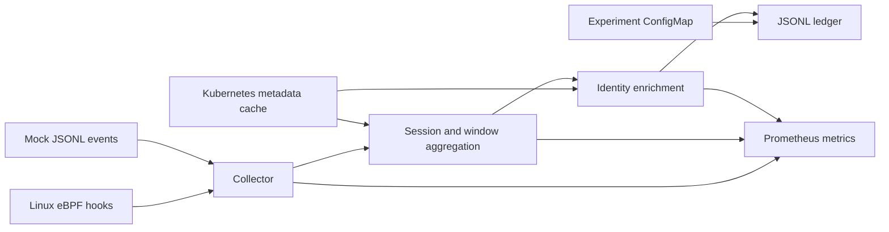

# FlowLedger

FlowLedger is a Kubernetes-aware eBPF flow evidence ledger for network observability and cloud-native intrusion-detection research. A node agent collects TCP lifecycle events, traffic statistics, and bounded TLS handshake metadata, enriches them with Kubernetes identity, and writes JSONL records for downstream analysis.

The current agent emits schema **`v1alpha7`** with feature set **`flowledger-fast-features-v2`**. It supports local mock replay and experimental Linux eBPF collection. The repository also contains baseline-cache, anomaly-scoring, and Isolation Forest inference components under `pkg/nodemodel`; these are not yet connected to the node-agent pipeline. Detection, alerting, and slow-path review remain future integration work.

## How it works



- **Collection:** TCP lifecycle tracepoints, send/receive accounting hooks, optional retransmission tracking, and cgroup v2 packet hooks. IPv4 and IPv4-mapped IPv6 sockets are supported; native IPv6 traffic is not collected.
- **Aggregation:** lifetime session summaries and configurable window deltas, with counter-reset detection, baseline validity, and a final partial window when a connection ends.
- **Identity:** cgroup/Pod mapping, workload ownership, Service and EndpointSlice context, and per-connection source identity snapshots. Destination identity is resolved when records are emitted.
- **Features:** bytes and send/receive observation counts; aggregate and directional packet-size/IAT histograms; observed SKB counts; TCP flags, TTL and header envelopes; local retransmission statistics; and best-effort JA4/JA4S metadata.
- **Storage:** local JSONL files with size/age rotation and retention of rotated files.
- **Diagnostics:** Prometheus metrics, periodic diagnostic logs, and a static eBPF resource-audit command.

## Quick start: local mock replay

Requires Go **1.25 or newer**. Mock mode needs neither Kubernetes nor BPF privileges.

```bash
go run ./cmd/node-agent \
  --mode=mock \
  --mock-events-path=./testdata/mock_flow_events.jsonl \
  --ledger-path=./flows.jsonl \
  --node-name=local-test
```

In another terminal:

```bash
head -n 2 ./flows.jsonl
curl http://localhost:9090/metrics
```

The agent flushes remaining sessions after consuming the file and stays running to serve metrics. Stop it with `Ctrl-C`. Outside a Pod, the agent uses an empty Kubernetes metadata cache: it reads in-cluster configuration, not your local kubeconfig. Kubernetes identities may therefore be `unknown` in local runs.

Use `go run ./cmd/node-agent --help` for all flags, or `make run-mock` for the same example.

## Reading the ledger

Each line is one JSON object. The two record types serve different purposes:

| Record type | `counter_semantics` | Intended use |
| --- | --- | --- |
| `window_summary` | `window_delta` | Incremental traffic within a window; default window size is 30 seconds |
| `session_summary` | `lifetime_cumulative` | Whole-connection totals for diagnostics |

**Do not sum session totals together with window deltas:** they describe overlapping traffic. For window-based analysis, select `record_type == "window_summary"` and inspect `window_valid` before using counters.

With `jq` installed:

```bash
jq -c 'select(.record_type == "window_summary" and .window_valid == true) |
  {flow_id, window_id, window_start_time, end_time, final_window,
   src_ip, dst_ip, bytes_out, bytes_in}' ./flows.jsonl
```

Important field semantics:

- `window_invalid_reason` identifies an unknown initial baseline or a counter reset. Invalid windows contain zero delta counters/histograms; these zeros must not be interpreted as measured inactivity. `counter_epoch` separates counter lineages.
- `final_window` marks the last, potentially shorter interval. Use the record's timestamps for its actual span.
- `packets_out` / `packets_in` count send/receive observations from socket hooks. `observed_skb_packets_out` / `observed_skb_packets_in` count observations at cgroup SKB hooks. Neither is a guarantee of physical wire-packet counts, especially with segmentation offload.
- Histogram-based statistics are estimates. Raw packet-length and IAT sequences are not retained. Directional IAT histograms measure intervals between packets in the same direction.
- Extrema and other non-additive fields, such as TTL ranges, TCP flag OR-masks, and connection duration, retain lifetime context on window records.
- `src` / `dst` and `_out` / `_in` describe the observed local socket and its traffic directions. A server-side observation is a separate perspective from the client's record; avoid treating both as unique connections without an explicit deduplication policy.
- Source identity is resolved near connection establishment, retried within bounded limits, and frozen for that connection generation. Missing mappings and availability flags are part of the data contract.

The record structure and field definitions are in [pkg/ledger/writer.go](pkg/ledger/writer.go). Preserve `schema_version` when building datasets so downstream consumers can identify the data contract.

## Run the eBPF collector locally

The experimental collector requires Linux with compatible BPF/BTF, tracepoint and kprobe support, and sufficient BPF privileges. Packet features and TLS inspection additionally require cgroup v2. Generated objects are checked in for Linux amd64 and arm64, so a normal build does not require Clang.

Build as your regular user, then run the binary with privileges:

```bash
go build -o /tmp/flowledger-node-agent ./cmd/node-agent
sudo /tmp/flowledger-node-agent \
  --mode=ebpf \
  --node-name=local-ebpf-test \
  --ledger-path=./flows.jsonl \
  --window-size=30s
```

Generate IPv4 TCP activity in another terminal, then inspect the ledger and metrics:

```bash
curl -4 https://example.com
curl http://localhost:9090/metrics
```

The collector uses `sock/inet_sock_set_state`, an early `tcp_connect` hook, `tcp_sendmsg` / `tcp_recvmsg`, and best-effort `tcp/tcp_retransmit_skb` tracking. Optional `cgroup_skb/ingress` and `cgroup_skb/egress` hooks provide packet and TLS observations. Check startup logs for attachment failures; some optional hooks can fail while the agent continues with reduced coverage.

The following collection flags default to `true`:

```text
--ebpf-enable-traffic-accounting
--ebpf-enable-tcp-basic-metrics
--ebpf-enable-packet-timing
--ebpf-enable-packet-histogram
--ebpf-enable-tls-handshake-inspect
--ebpf-enable-header-aggregates
--ebpf-enable-netflow-v2-histogram
```

Set a flag explicitly to `false` to disable it. The `--ebpf-stats-emit-interval` default is `5s`, but kernel emission is currently governed by `EBPF_EMIT_INTERVAL_NS` in [bpf/flow_events.bpf.c](bpf/flow_events.bpf.c). Changing the CLI flag alone does not change that kernel interval; modify the constant and regenerate the bindings for that change.

## Deploy to Kubernetes

Build an image and make it available to every target node, either through your registry or your local cluster's image-loading mechanism:

```bash
docker build -t flow-ledger:v0 .
```

Both supplied manifests use `flow-ledger:v0` with `imagePullPolicy: IfNotPresent`. This is a development image tag, not the ledger schema version. For registry deployment, push a distinct image tag and update `image:` in the selected DaemonSet manifest.

Apply the shared namespace, RBAC, and experiment labels first:

```bash
kubectl apply -f deploy/namespace.yaml
kubectl apply -f deploy/rbac.yaml
kubectl apply -f deploy/configmap.yaml
```

Then choose **one** collection mode.

### Mock validation

```bash
kubectl apply -f deploy/mock-events-configmap.yaml
kubectl apply -f deploy/daemonset.yaml
kubectl -n flow-ledger-system rollout status daemonset/flow-ledger-node-agent
```

This replays synthetic events to validate startup, metadata enrichment, file writing, and metrics.

### Real eBPF collection

```bash
kubectl apply -f deploy/experimental/daemonset-ebpf.yaml
kubectl -n flow-ledger-system rollout status daemonset/flow-ledger-node-agent-ebpf
```

The experimental DaemonSet runs privileged and mounts host BPF, tracing, and cgroup filesystems. It uses the agent's default 30-second window.

**The two DaemonSets share host port `9090` and `/var/lib/flow-ledger/flows.jsonl`. Run only one per node.** When switching from mock to eBPF, delete the mock DaemonSet first:

```bash
kubectl -n flow-ledger-system delete daemonset flow-ledger-node-agent
```

Reverse the deletion when switching back. Keep mock and real-traffic output in separate files or archive the old ledger before switching modes.

View eBPF logs and metrics (use `flow-ledger-node-agent` for mock mode):

```bash
kubectl -n flow-ledger-system logs ds/flow-ledger-node-agent-ebpf --tail=50
kubectl -n flow-ledger-system port-forward ds/flow-ledger-node-agent-ebpf 9090:9090
```

Read `/var/lib/flow-ledger/flows.jsonl` directly on each node. Files are node-local; the manifests do not deploy a central storage service or a Prometheus server.

The agent waits up to 30 seconds for Kubernetes informer synchronization and exits on sync failure unless `--allow-unsynced-metadata=true`. Experiment labels come from the `flow-ledger-experiment` ConfigMap, refresh periodically, and retain their last known values on read errors.

## Configuration and retention

| Flag | Default | Purpose |
| --- | --- | --- |
| `--mode` | `mock` | Select mock replay or eBPF |
| `--window-size` | `30s` | Window-summary interval |
| `--session-timeout` | `1m` | Session inactivity timeout |
| `--long-lived-threshold` | `5m` | Threshold for `is_long_lived` |
| `--metrics-addr` | `:9090` | Metrics listener |
| `--metadata-sync-timeout` | `30s` | Informer synchronization deadline |
| `--drop-nonlocal-src` | `true` | Suppress records attributed to a source Pod on another node; useful for shared-kernel kind clusters |
| `--ebpf-flow-map-max-entries` | `65536` | LRU flow-stat map capacity |
| `--ebpf-map-stats-interval` | `15s` | Map occupancy sampling; negative disables sampling |
| `--ledger-max-bytes` | `104857600` (100 MiB) | Active-file size rotation; `0` disables |
| `--ledger-max-age` | `0s` | Active-file age rotation; disabled by default |
| `--ledger-retention-age` | `24h` | Delete rotated files older than this; `0` disables |
| `--ledger-retention-bytes` | `2147483648` (2 GiB) | Limit total rotated-file bytes; `0` disables |
| `--ledger-retention-interval` | `5m` | Retention sweep interval |

**Rotated files are deleted automatically by default.** For research runs that must retain every record, disable both retention limits and arrange sufficient disk space or external archiving:

```text
--ledger-retention-age=0s --ledger-retention-bytes=0
```

Retention applies to rotated files; it is not a hard limit on total filesystem use. Compression and upload are not implemented. Use `--cluster-id` / `FLOWLEDGER_CLUSTER_ID` and `--agent-id` / `FLOWLEDGER_AGENT_ID` to identify collection sources. Node naming uses `--node-name`, then `NODE_NAME`, then the hostname.

## Diagnostics and development

Metrics include event/session counts, unknown identity mappings, ledger write errors, cgroup resolution, TLS parsing, BPF map occupancy, and drop reasons. See [pkg/metrics/metrics.go](pkg/metrics/metrics.go) for the full list.

Useful diagnostics include `flowledger_phantom_src_filtered_total`, `flowledger_ebpf_map_occupancy_ratio`, `flowledger_ebpf_packet_ep_miss_total`, and `flowledger_ebpf_drops_by_reason_total`. The latter includes `packet_direct_miss` (fallback lookup used) and `local_ep_alias_overwrite` (a shared index slot was replaced); these two counters are attribution diagnostics, not necessarily lost events.

Inspect the embedded BPF object's struct sizes, map capacities, and ring-buffer budgets without loading programs or contacting a cluster:

```bash
go run ./cmd/ebpf-resource-audit
go run ./cmd/ebpf-resource-audit --json
```

Build and run the existing tests:

```bash
make build
make test
```

After changing the BPF C source, regenerate the checked-in objects and Go bindings with Clang and the `bpf2go` tool pinned in `go.mod`:

```bash
make generate-ebpf
```

Generation uses `-no-strip`, so `llvm-strip` is not required. Tests cover aggregation, schema contracts, identity snapshots, metadata caches, TLS parsing, retention, BPF layouts, and the standalone model components. Unit tests do not establish live kernel compatibility; use a privileged smoke test on your target nodes as well.

## Repository layout

| Path | Contents |
| --- | --- |
| `cmd/node-agent/` | Agent entry point, flags, pipeline, and metrics routing |
| `cmd/ebpf-resource-audit/` | Static resource report for the embedded BPF object |
| `bpf/` | Kernel-side TCP collection and packet attribution |
| `pkg/collector/` | Mock/eBPF collectors, generated bindings, TLS parsing |
| `pkg/sessionizer/`, `pkg/features/` | Connection aggregation, window deltas, derived features |
| `pkg/k8smeta/`, `pkg/identity/` | Kubernetes caches, cgroup resolution, endpoint identity |
| `pkg/ledger/`, `pkg/experiment/`, `pkg/metrics/` | Storage, experiment labels, observability |
| `pkg/nodemodel/` | Standalone baseline cache, deviation scores, Isolation Forest inference |
| `deploy/` | Shared Kubernetes resources and separate mock/eBPF DaemonSets |
| `scripts/`, `testdata/` | Retransmission smoke-test script and mock fixtures |

## Collection boundaries

FlowLedger is a research prototype. Coverage depends on kernel support, hook attachment, NAT paths, and metadata freshness. Exact-tuple packet lookup distinguishes concurrent connections sharing a listening port; the fallback local-endpoint index remains best-effort where address translation prevents a direct match. Early TCP flag coverage is also best-effort, particularly for passive connections and failed attempts.

TLS inspection copies at most 1024 bytes per direction from the first matching ClientHello/ServerHello attempt to userspace for parsing. The ledger stores fingerprints, visible version/ALPN metadata, and a truncated SHA-256 SNI hash. It does not store plaintext SNI, certificates, or application payloads. TLS is not decrypted, and fragmented handshakes are not reassembled; handshake fields may be unavailable.

Native IPv6, UDP/QUIC collection, packet capture, HTTP content extraction, deployed ML inference, alerting, and slow-path reviewer verdicts are outside the current agent implementation. Model/review fields in ledger records remain placeholders. Host-network identity can be ambiguous, and unknown mappings should be handled explicitly by downstream consumers.
